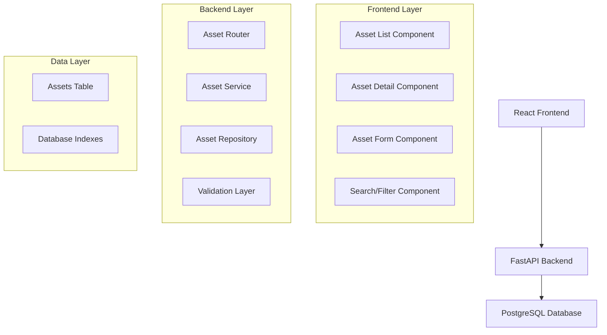

# Asset Management System Design Document

## Overview

The Asset Management System is a full-stack web application built with a React TypeScript frontend, FastAPI Python backend, and PostgreSQL database. The system follows a three-tier architecture with clear separation of concerns, RESTful API design, and responsive web interface.

The system enables CRUD operations on assets through a clean, intuitive web interface while maintaining data integrity and providing robust error handling.

## Architecture

### High-Level Architecture



### Technology Stack

- **Frontend**: React 18+ with TypeScript, React Router for navigation, Axios for HTTP requests
- **Backend**: FastAPI with Python 3.9+, SQLAlchemy ORM, Pydantic for validation
- **Database**: PostgreSQL 13+ with appropriate indexes for performance
- **Styling**: CSS Modules or Styled Components for responsive design

## Components and Interfaces

### Frontend Components

#### AssetList Component

- Displays paginated list of assets in table format
- Integrates search and filter functionality
- Handles navigation to detail and edit views
- Manages loading and error states

#### AssetDetail Component

- Shows complete asset information
- Provides edit and delete action buttons
- Handles asset not found scenarios

#### AssetForm Component

- Reusable form for create and edit operations
- Implements client-side validation
- Handles form submission and error display

#### SearchFilter Component

- Provides search input and category/status filters
- Manages filter state and communicates with parent components

### Backend API Endpoints

```
GET    /api/assets              - List assets with pagination and filters
POST   /api/assets              - Create new asset
GET    /api/assets/{id}         - Get specific asset details
PUT    /api/assets/{id}         - Update existing asset
DELETE /api/assets/{id}         - Delete asset
GET    /api/assets/categories   - Get available categories
```

### API Request/Response Models

#### Asset Model

```typescript
interface Asset {
  id: number;
  name: string;
  description: string;
  category: string;
  serialNumber: string;
  purchaseDate: string;
  purchasePrice: number;
  status: "active" | "inactive" | "maintenance" | "disposed";
  createdAt: string;
  updatedAt: string;
}
```

#### Asset Creation Request

```typescript
interface CreateAssetRequest {
  name: string;
  description: string;
  category: string;
  serialNumber: string;
  purchaseDate: string;
  purchasePrice: number;
  status: "active" | "inactive" | "maintenance" | "disposed";
}
```

#### Asset List Response

```typescript
interface AssetListResponse {
  assets: Asset[];
  total: number;
  page: number;
  pageSize: number;
  totalPages: number;
}
```

## Data Models

### Database Schema

#### Assets Table

```sql
CREATE TABLE assets (
    id SERIAL PRIMARY KEY,
    name VARCHAR(255) NOT NULL,
    description TEXT,
    category VARCHAR(100) NOT NULL,
    serial_number VARCHAR(100) UNIQUE NOT NULL,
    purchase_date DATE NOT NULL,
    purchase_price DECIMAL(10,2) NOT NULL,
    status VARCHAR(20) NOT NULL CHECK (status IN ('active', 'inactive', 'maintenance', 'disposed')),
    created_at TIMESTAMP DEFAULT CURRENT_TIMESTAMP,
    updated_at TIMESTAMP DEFAULT CURRENT_TIMESTAMP
);

CREATE INDEX idx_assets_category ON assets(category);
CREATE INDEX idx_assets_status ON assets(status);
CREATE INDEX idx_assets_serial_number ON assets(serial_number);
CREATE INDEX idx_assets_name ON assets(name);
```

### SQLAlchemy Model

```python
class Asset(Base):
    __tablename__ = "assets"

    id = Column(Integer, primary_key=True, index=True)
    name = Column(String(255), nullable=False)
    description = Column(Text)
    category = Column(String(100), nullable=False)
    serial_number = Column(String(100), unique=True, nullable=False)
    purchase_date = Column(Date, nullable=False)
    purchase_price = Column(Numeric(10, 2), nullable=False)
    status = Column(Enum(AssetStatus), nullable=False)
    created_at = Column(DateTime, default=datetime.utcnow)
    updated_at = Column(DateTime, default=datetime.utcnow, onupdate=datetime.utcnow)
```

### Pydantic Schemas

```python
class AssetBase(BaseModel):
    name: str = Field(..., min_length=1, max_length=255)
    description: Optional[str] = None
    category: str = Field(..., min_length=1, max_length=100)
    serial_number: str = Field(..., min_length=1, max_length=100)
    purchase_date: date
    purchase_price: Decimal = Field(..., gt=0)
    status: AssetStatus

class AssetCreate(AssetBase):
    pass

class AssetUpdate(AssetBase):
    pass

class AssetResponse(AssetBase):
    id: int
    created_at: datetime
    updated_at: datetime

    class Config:
        from_attributes = True
```

## Error Handling

### Frontend Error Handling

- Global error boundary for unhandled React errors
- HTTP error interceptors for API communication
- Form validation errors displayed inline
- Toast notifications for operation feedback
- Loading states during API calls

### Backend Error Handling

- Custom exception classes for different error types
- HTTP status codes following REST conventions
- Structured error responses with error codes and messages
- Input validation using Pydantic models
- Database constraint violation handling

### Error Response Format

```typescript
interface ErrorResponse {
  error: {
    code: string;
    message: string;
    details?: any;
  };
}
```

## Testing Strategy

### Frontend Testing

- Unit tests for components using React Testing Library
- Integration tests for API communication
- End-to-end tests using Cypress for critical user flows
- Visual regression tests for UI consistency

### Backend Testing

- Unit tests for service layer logic
- Integration tests for API endpoints
- Database tests with test database
- Validation tests for Pydantic models

### Test Coverage Goals

- Minimum 80% code coverage for backend
- Critical path coverage for frontend components
- All API endpoints covered by integration tests

## Security Considerations

### Input Validation

- Server-side validation for all inputs
- SQL injection prevention through ORM
- XSS prevention through proper data sanitization

### Data Protection

- Sensitive data handling best practices
- Database connection security
- HTTPS enforcement in production

## Performance Considerations

### Database Optimization

- Appropriate indexes on frequently queried columns
- Pagination to limit result set sizes
- Connection pooling for database connections

### Frontend Optimization

- Component memoization for expensive renders
- Lazy loading for large asset lists
- Debounced search to reduce API calls

### Caching Strategy

- Browser caching for static assets
- API response caching where appropriate
- Database query optimization
